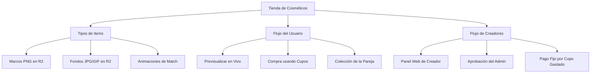

# 🏪 Tienda de Cosméticos & Santuario de Parejas (Plan de Arquitectura y Flujo)

Este documento define la arquitectura y el diseño técnico para la **Tienda de Cosméticos** de OurStory. El objetivo es crear un sistema de personalización que use **los cupos de citas como la moneda oficial** de la tienda. Esto incentiva a las parejas a interactuar diariamente con la app (trivia, rachas) para acumular cupos o a comprar paquetes de cupos con dinero real.

---

## 🗺️ Mapa de Características



---

## 🗄️ Diseño del Modelo de Base de Datos (PostgreSQL)

Para que el catálogo y las transacciones sean dinámicas y de alto rendimiento, se proponen las siguientes tablas en PostgreSQL.

### 1. Tabla de Cosméticos (`cosmetics`)
Define el catálogo de items disponibles.

```sql
CREATE TABLE cosmetics (
    id SERIAL PRIMARY KEY,
    type VARCHAR(50) NOT NULL, -- 'frame', 'background', 'match_animation'
    name VARCHAR(100) NOT NULL,
    description TEXT,
    price_in_slots INT NOT NULL DEFAULT 20, -- Precio en cupos (Mínimo recomendado: 20 cupos)
    resource_url TEXT NOT NULL, -- URL del recurso en Cloudflare R2
    extra_styles JSONB DEFAULT '{}'::jsonb, -- Estilos CSS extra (ej: gradientes, animaciones)
    creator_id INT REFERENCES creators(id) ON DELETE SET NULL,
    approved BOOLEAN DEFAULT FALSE, -- Aprobación del Admin para mostrarse en la tienda
    created_at TIMESTAMP WITH TIME ZONE DEFAULT CURRENT_TIMESTAMP
);
```

### 2. Tabla de Creadores/Diseñadores (`creators`)
Información del perfil del diseñador gráfico.

```sql
CREATE TABLE creators (
    id SERIAL PRIMARY KEY,
    user_id INT REFERENCES users(id) ON DELETE CASCADE,
    portfolio_name VARCHAR(100) NOT NULL,
    payout_info TEXT, -- Datos bancarios para liquidación (transferencia)
    total_earned_clp INT DEFAULT 0, -- Ganancias históricas en pesos chilenos
    created_at TIMESTAMP WITH TIME ZONE DEFAULT CURRENT_TIMESTAMP
);
```

### 3. Inventario de la Pareja (`couple_cosmetics`)
Registra qué cosméticos ha adquirido cada pareja.

```sql
CREATE TABLE couple_cosmetics (
    couple_id INT REFERENCES couples(id) ON DELETE CASCADE,
    cosmetic_id INT REFERENCES cosmetics(id) ON DELETE CASCADE,
    purchased_at TIMESTAMP WITH TIME ZONE DEFAULT CURRENT_TIMESTAMP,
    PRIMARY KEY (couple_id, cosmetic_id)
);
```

### 4. Historial de Ventas y Comisiones (`cosmetic_purchases_log`)
Permite registrar cada compra con cupos y calcular la comisión fija en dinero real.

```sql
CREATE TABLE cosmetic_purchases_log (
    id SERIAL PRIMARY KEY,
    couple_id INT REFERENCES couples(id),
    cosmetic_id INT REFERENCES cosmetics(id),
    creator_id INT REFERENCES creators(id),
    slots_spent INT NOT NULL, -- Cupos gastados (ej: 20 cupos)
    creator_payout_clp INT NOT NULL, -- Monto a transferir al creador (ej: $2.000 CLP)
    paid_to_creator BOOLEAN DEFAULT FALSE, -- Si ya le transferiste su parte
    payout_marked_at TIMESTAMP WITH TIME ZONE, -- Cuándo se marcó como pagado
    created_at TIMESTAMP WITH TIME ZONE DEFAULT CURRENT_TIMESTAMP
);
```

---

## 🎨 Funciones Innovadoras de la Tienda (UX/Neurodiseño)

### 1. Previsualización Instantánea ("Previsualizar")
Para convencer al usuario de comprar un cosmético, debe poder verlo aplicado en su propio perfil con un solo botón:
* **Cómo funciona:** Al hacer clic en "Previsualizar" en la tienda, el frontend guarda temporalmente las variables reactivas `previewTheme` y `previewFrame` en lugar de modificarlas en la base de datos.
* **Comportamiento visual:** El perfil cambia al instante mostrando el fondo y el marco seleccionados. Aparece una barra flotante elegante arriba que dice: *"Modo Previsualización activa. ¿Te gusta cómo queda?"* con los botones: **[Comprar ahora]** y **[Salir de la previsualización]**.
* **Seguridad:** Si el usuario cierra el modal o sale de la pestaña sin comprar, el perfil vuelve a cargar sus valores reales guardados en la base de datos.

### 2. Animaciones de Match (Engagement Activo)
Cuando ambos miembros de la pareja abren la app y presionan el botón de agendar cita al mismo tiempo:
* **Animación Premium:** En lugar de la transición clásica, se despliega una animación a pantalla completa (ej: corazones 3D flotando, estrellas de neón, destellos cósmicos, etc.) sincronizada a través de WebSockets.
* **Efecto de coleccionismo:** La tienda venderá packs de estas animaciones para que las parejas coleccionen y personalicen su "momento de vinculación".

### 3. Insignia del Creador y "Apoyo Directo"
* Cada item de la tienda mostrará el nombre del diseñador: `Diseñado por @SofiaG`.
* Al previsualizar o comprar, podemos mostrar una pequeña nota: *"El 70% de esta compra apoya directamente a @SofiaG"* para potenciar la empatía y motivar la compra ética dentro de la comunidad.

---

## 🛠️ Flujo de Endpoints API (Propuesta)

* `GET /api/store/cosmetics` -> Retorna el catálogo de cosméticos aprobados (`approved = true`), incluyendo detalles del creador.
* `POST /api/store/cosmetics/buy` -> Valida que la pareja tenga suficientes cupos (`slots`), resta los cupos de la tabla `couples`, agrega el item a `couple_cosmetics`, y registra la compra en `cosmetic_purchases_log` con el cálculo de comisión.
* `GET /api/profile/my-cosmetics` -> Retorna los cosméticos adquiridos por la pareja actual.

---

## 💡 Modelo Económico Recomendado (Tokenomics Híbrido)

Para proteger la rentabilidad de OurStory y evitar pérdidas de caja en compras realizadas con cupos gratuitos, el sistema diferencia la procedencia de los cupos y aplica tarifas de pago diferenciadas para los creadores.

### 🪙 1. Tipos de Cupos y Reglas de Vencimiento
En la base de datos (tabla `couples`), el saldo de la pareja se divide en dos columnas:
1. **Cupos Comprados (`purchased_slots`):** Obtenidos con dinero real (MercadoPago / IAP). **NUNCA vencen**.
2. **Cupos Gratuitos (`free_slots`):** Obtenidos mediante mensualidad, trivia, juegos y rachas. **Vencen al final de cada mes de facturación** (30 días).

> [!NOTE]
> **Prioridad de Consumo:**
> Al agendar una cita o comprar en la tienda, el sistema consume siempre primero los **Cupos Gratuitos** (ya que tienen vencimiento) y luego los **Cupos Comprados**.

---

### 🧮 2. Tarifas de Pago al Creador por Tipo de Cupo
Cuando un usuario gasta cupos en la tienda, el creador recibe una compensación en dinero real según el tipo de cupo consumido:

* **Pago por Cupo Comprado gastado:** **$150 CLP** por cupo.
* **Pago por Cupo Gratuito gastado:** **$15 CLP** por cupo (tarifa token del 10% para incentivar la economía sin generar pérdidas a OurStory).

---

### 📈 3. Resolución de Casos Prácticos (Compras Híbridas)
Si un cosmético de creador tiene un precio de **20 cupos**, calculamos el pago al creador y tu ganancia neta en los siguientes escenarios:

#### Caso A: Compra 100% con Cupos Gratuitos (Ahorro)
* **Consumo:** 20 cupos gratuitos / 0 cupos comprados.
* **Pago al Creador:** $20 \times \$15 = \textbf{\$300 CLP}$.
* **Tu Costo de Operación:** Solo $300 CLP. La app no pierde caja significativa y ganas una pareja altamente activa en trivia y retención.

#### Caso B: Compra Híbrida (10 Cupos Gratuitos + 10 Cupos Comprados)
* **Consumo:** 10 cupos gratuitos / 10 cupos comprados.
* **Pago al Creador:** $(10 \times \$15) + (10 \times \$150) = \$150 + \$1.500 = \textbf{\$1.650 CLP}$.
* **Ingreso Bruto Mínimo de OurStory** (por los 10 cupos comprados): $4.990 CLP.
* **Tu Ganancia Neta** (descontando 15% IAP y pago al creador): $\$4.241 - \$1.650 = \textbf{\$2.591 CLP}$.

#### Caso C: Compra Híbrida (5 Cupos Gratuitos + 15 Cupos Comprados)
* **Consumo:** 5 cupos gratuitos / 15 cupos comprados.
* **Pago al Creador:** $(5 \times \$15) + (15 \times \$150) = \$75 + \$2.250 = \textbf{\$2.325 CLP}$.
* **Ingreso Bruto Mínimo de OurStory** (por los 15 cupos comprados): $7.485 CLP.
* **Tu Ganancia Neta** (descontando 15% IAP y pago al creador): $\$6.362 - \$2.325 = \textbf{\$4.037 CLP}$.

#### Caso D: Compra 100% con Cupos Comprados
* **Consumo:** 0 cupos gratuitos / 20 cupos comprados.
* **Pago al Creador:** $20 \times \$150 = \textbf{\$3.000 CLP}$.
* **Ingreso Bruto de OurStory** (por los 20 cupos comprados): $9.980 CLP.
* **Tu Ganancia Neta** (descontando 15% IAP y pago al creador): $\$8.483 - \$3.000 = \textbf{\$5.483 CLP}$ (Rentabilidad del 55%).

---

### 🛡️ Medidas de Seguridad Contra Fraudes
Dado que pagas dinero real por cupos virtuales (que se pueden ganar de forma gratuita), debemos evitar que creadores con cuentas falsas "auto-compren" sus items usando cupos gratis para retirar dinero real de OurStory:

1. **Límite de Cupos Gratuitos por Cuenta:** Una pareja solo puede acumular un máximo de cupos gratuitos al mes mediante trivia/rachas.
2. **Mínimo de Ventas para Retiro:** Los creadores pueden retirar sus fondos acumulados solo a partir de un balance mínimo (ej. $10.000 CLP).
3. **Periodo de Retención (Holding):** Las ganancias de una compra quedan congeladas por 7 a 14 días antes de poder ser retiradas por el creador, previniendo abusos de cuentas recién creadas.

---

## 📄 Términos y Condiciones: "OurStory - Creator Program" (App Web de Creadores)

Esta sección define las políticas legales obligatorias para proteger a OurStory en la plataforma web destinada a los diseñadores:

1. **Estructura de Recompensas (Sin revelar el split exacto):**
   * El creador acepta que la moneda de cambio dentro de la aplicación móvil son los "Cupos de Cita".
   * Por cada cosmético vendido, el creador recibirá una compensación en pesos chilenos (CLP) calculada de forma dinámica según el tipo de cupo utilizado por la pareja compradora:
     * **Cupos Comprados con Dinero Real:** El creador recibe una compensación premium de **$150 CLP** por cada cupo de este tipo invertido en su cosmético.
     * **Cupos Gratuitos (Trivia, Rachas, Regalos del sistema):** El creador recibe una compensación promocional de **$15 CLP** por cada cupo de este tipo invertido en su cosmético.
2. **Políticas de Pago y Liquidación:**
   * **Monto Mínimo de Retiro:** Se establece un saldo acumulado mínimo de **$10.000 CLP** para poder solicitar una transferencia de fondos.
   * **Periodo de Validación (Holding):** Todas las transacciones tienen un periodo de retención de **10 días hábiles** desde la fecha de compra para auditoría antifraude antes de pasar al saldo retirable del creador.
   * **Método de Pago:** Las liquidaciones se realizarán vía transferencia bancaria electrónica a la cuenta chilena indicada por el creador en su perfil.
3. **Propiedad Intelectual y Aprobación de Contenido:**
   * El creador garantiza que posee todos los derechos de propiedad intelectual sobre los diseños (marcos, fondos, animaciones) que sube. OurStory no se hace responsable por reclamos de copyright de terceros.
   * **Derecho de Rechazo y Retiro:** OurStory se reserva el derecho exclusivo de aprobar, rechazar o remover cualquier diseño de la tienda sin previo aviso si infringe normas de convivencia, contiene material explícito, copy-paste de otros juegos, o si se detecta sospecha de manipulación fraudulenta.
   * **Suspensión de Cuenta:** Si se comprueba que un creador creó cuentas falsas en la app móvil para "auto-comprarse" sus cosméticos con cupos gratis del sistema, su cuenta de creador será suspendida permanentemente y todos los fondos acumulados serán confiscados por fraude.

---

## 📱 Adiciones a los Términos y Condiciones de OurStory (App Móvil para Parejas)

Cláusulas necesarias para actualizar el documento de términos de la app móvil dirigidos a los usuarios:

1. **Políticas de Cupos (Slots):**
   * **Cupos Comprados:** Los cupos adquiridos mediante pasarelas de pago de dinero real (MercadoPago, Google/Apple In-App Purchases) son de carácter permanente y **no tienen fecha de vencimiento**.
   * **Cupos Gratuitos:** Todos los cupos otorgados de forma gratuita por el sistema (mensualidad básica de 10 cupos, recompensas de trivia diaria, bonificaciones de rachas y eventos de la comunidad) tienen una vigencia de **30 días de calendario** y expiran al final de cada ciclo mensual de la pareja si no son utilizados.
   * **Prioridad de Gasto:** Al agendar una cita o adquirir cosméticos decorativos en el Santuario, el sistema descontará siempre en primer lugar los cupos gratuitos por vencer.
2. **Naturaleza de los Bienes Digitales y Reembolsos:**
   * Al ser bienes digitales de consumo y personalización inmediata, las compras de cosméticos (fondos, marcos, animaciones) realizadas en la tienda del Santuario son **definitivas y no reembolsables**. No se realizarán devoluciones de cupos una vez adquirido el cosmético.
3. **Coposesión de Cosméticos en Pareja:**
   * Todos los cosméticos adquiridos pertenecen a la **relación de pareja (couple_id)** y se comparten en el Santuario común, no a las cuentas de usuario individuales.
   * **En caso de desvinculación (Unpair):** Si la pareja decide separarse mediante la función de desvincularse de la app, todos los cosméticos adquiridos bajo ese vínculo se disuelven de forma permanente junto con el Santuario de la pareja. Los cosméticos no son transferibles a nuevas relaciones ni a otros usuarios individuales.

---

## ❤️ Explicación Simple para tu Novia (¡Para mostrársela de forma tierna!)

> *"¡Hola! Te cuento cómo va a funcionar la Tienda del Santuario de Parejas de OurStory. La idea es súper linda porque ayuda a que la app se mantenga solita y sea interactiva para todos:*
>
> 1. **¿Cómo se compra en la tienda?**
>    La moneda de la tienda son los **cupos de citas** de las parejas. En vez de pagar con dinero directo por un fondo lindo o un marco de flores para la foto de perfil, las parejas usan los cupos que tienen guardados. 
> 2. **¿De dónde salen estos cupos?**
>    * O los ganan **gratis** esforzándose juntos: respondiendo la trivia diaria y manteniendo su racha de amor encendida.
>    * O los **compran** con dinero real si quieren subir muchas fotos de un viaje o si quieren un cosmético exclusivo rápido. Los cupos que compran nunca vencen, pero los gratis sí expiran al mes para que jueguen seguido.
> 3. **¿Cómo apoyamos a los diseñadores gráficos?**
>    Queremos que diseñadores independientes suban marcos hermosos y fondos mágicos a OurStory. Cuando una pareja gasta cupos en el diseño de alguien, nosotros le pagamos dinero real a ese creador:
>    * Si la pareja pagó con **cupos comprados**, el creador recibe una recompensa grande de **$150 pesos**.
>    * Si la pareja usó **cupos gratis** que ahorró jugando, el creador recibe una recompensa simbólica de **$15 pesos** para valorar su esfuerzo.
>
> *Así, logramos tres cosas mágicas: las parejas juegan más para ganarse sus marcos, la app gana dinero con quienes compran cupos de urgencia, los creadores de arte ganan dinero real por su talento, ¡y OurStory se auto-sostiene con seguridad!"*


